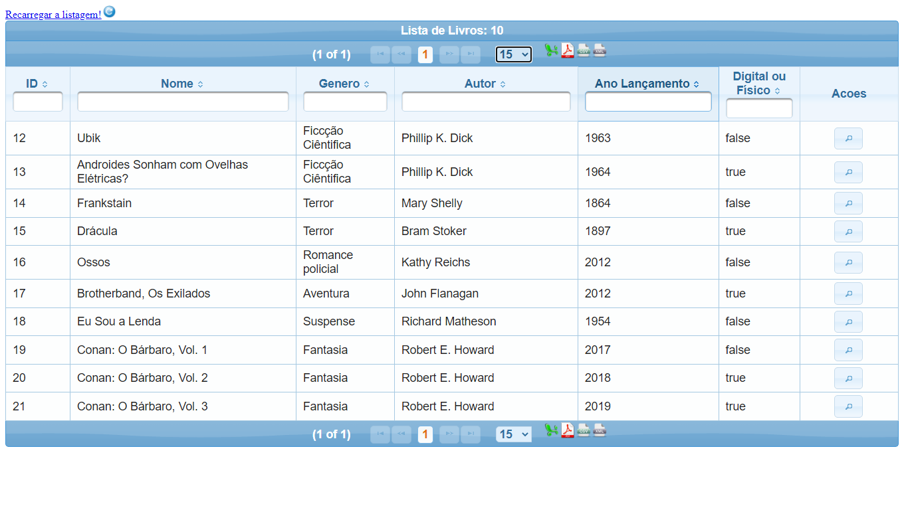

# "C.R.U.D" feito com Spring, JSF, PrimeFaces.

 **Para iniciar o projeto**: 
 
- É necessário ter o banco de dados **PostgreSQL**, e criar também o banco de dados com o nome **livros** e copiar os códigos do arquivo com o nome **create.sql**.

- É necessário ter o **Postman** ou, o **Insomnia**, com um dos dois instalados use o protocolo **post** lembrando de usar a syntax **JSON** como o exemplo abaixo.

### Populando o banco de dados:

***

###### Lembre: colocar objeto 1 por 1, somente as chaves e não as virgulas.

```json
     {
        "nome": "Ubik",
        "genero": "Ficcção Ciêntifica",
        "autor": "Phillip K. Dick",
        "anoLancamento": 1963,
        "digitalOuFisico": false
    },
    {
        "nome": "Androides Sonham com Ovelhas Elétricas?",
        "genero": "Ficcção Ciêntifica",
        "autor": "Phillip K. Dick",
        "anoLancamento": 1964,
        "digitalOuFisico": true
    },
    {
        "nome": "Frankstain",
        "genero": "Terror",
        "autor": "Mary Shelly",
        "anoLancamento": 1864,
        "digitalOuFisico": false
    },
    {
        "nome": "Drácula",
        "genero": "Terror",
        "autor": "Bram Stoker",
        "anoLancamento": 1897,
        "digitalOuFisico": true
    },
    {
        "nome": "Ossos",
        "genero": "Romance policial",
        "autor": "Kathy Reichs",
        "anoLancamento": 2012,
        "digitalOuFisico": false
    },
    {
        "nome": "Brotherband, Os Exilados",
        "genero": "Aventura",
        "autor": "John Flanagan",
        "anoLancamento": 2012,
        "digitalOuFisico": true
    },
    {
        "nome": "Eu Sou a Lenda",
        "genero": "Suspense",
        "autor": "Richard Matheson",
        "anoLancamento": 1954,
        "digitalOuFisico": false
    },
    {
        "nome": "Conan: O Bárbaro, Vol. 1",
        "genero": "Fantasia",
        "autor": "Robert E. Howard",
        "anoLancamento": 2017,
        "digitalOuFisico": false
    },
    {
        "nome": "Conan: O Bárbaro, Vol. 2",
        "genero": "Fantasia",
        "autor": "Robert E. Howard",
        "anoLancamento": 2018,
        "digitalOuFisico": true
    }
```

## Features do programa:

***

- Pesquisar por id, genero, autor, e por digital ou físico (boolean).
- Modal com todas as informações do objeto (livro).
- Exportar os dados do livro com **JasperReports** em formatos **csv**, **xml**, **pdf**, **excel**.

***

### Esclarecimentos em relação ao projeto:

Bem eu tentei fazer o projeto sem ter um conhecimento em **JSF** no inicio tentei procurar conteúdo sobre **JSF**, mais é bem escasso até que eu achei uma playlist no **YouTube** chamada "Spring Boot".

***

Fui seguindo com o instrutor usando api rest no inicio achei estranhando mais continuei seguindo, até que chegou a parte do **Bean** quando ele usou apenas o método listar foi aí que eu percebi que ele só usou a **rest api** para apenas popular o banco de dados ainda, estou estudando sobre o assunto com o curso da **SoftBlue**.

***

#### Coisas ainda a completar:

- [ ] Terminar o **C.R.U.D**.
- [ ] Melhorar o layout do **JasperReports**
- [ ] Criar mais páginas.
- [ ] Criar mais métodos funcionais.

***

## Lembre depois do projeto iniciado acessar o url: http://localhost:8080/livraria.jr

